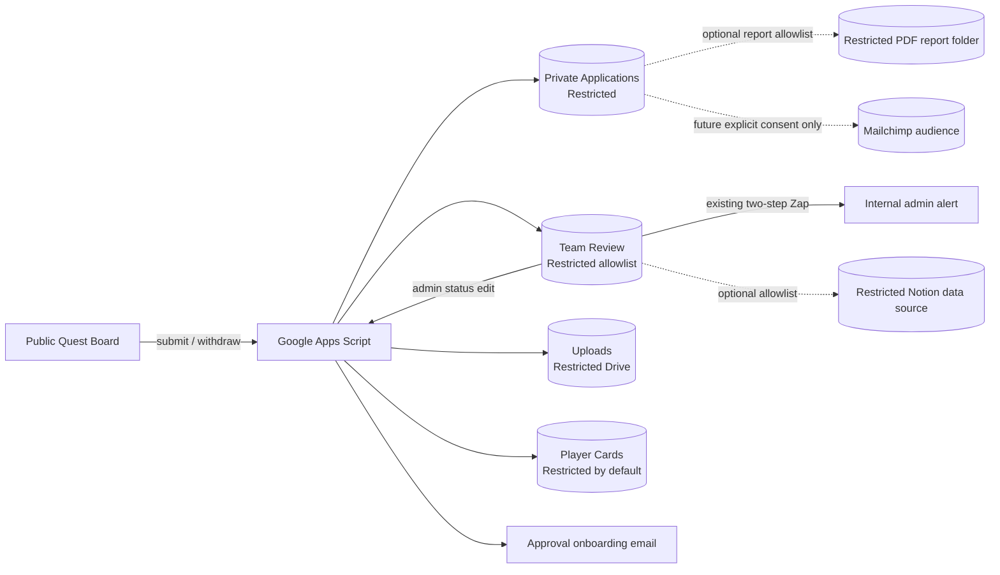
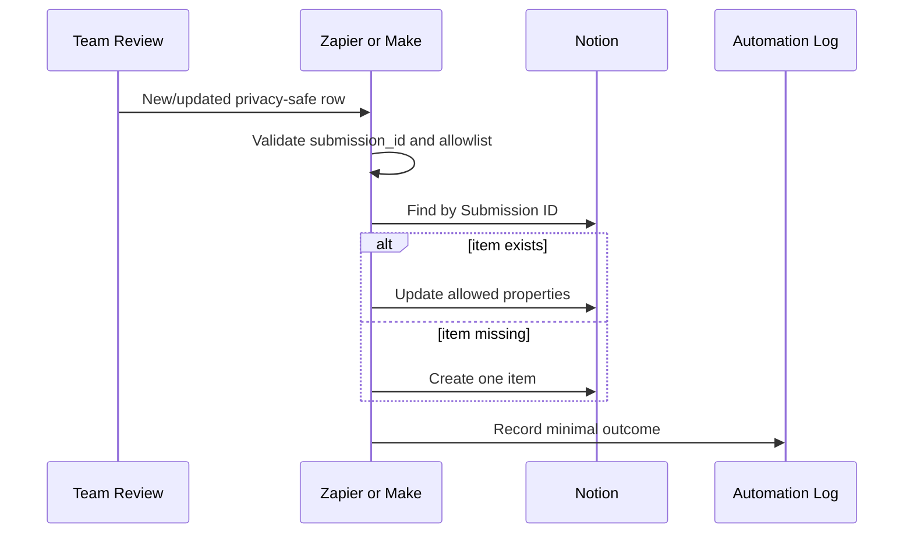
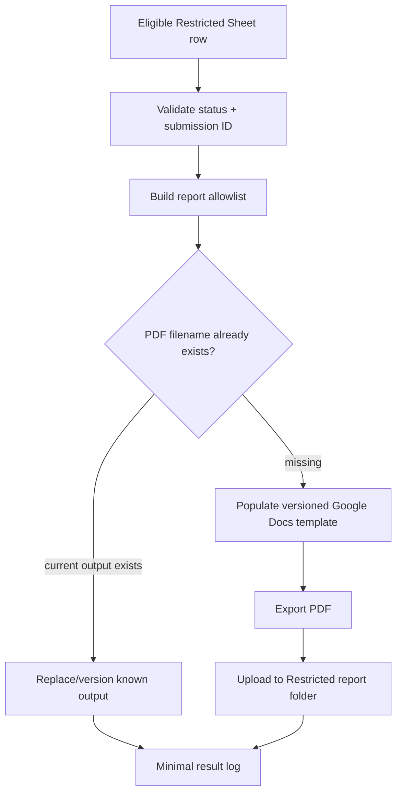
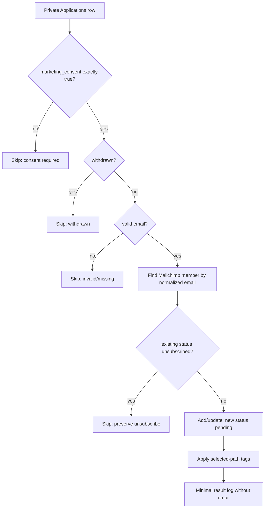

# Sunrise Quest Board Automation Implementation Plan

Reviewed: September 26, 2026

## 1. Architecture boundary

The existing Apps Script backend remains authoritative. Zapier and Make are optional projection/reporting layers; neither receives authority to approve applications, withdraw them, create Player Cards, or send the existing approval/onboarding email.



The dotted integrations are prepared but not authorized or active.

## 2. Reusable implementation artifacts

| Artifact | Purpose |
| --- | --- |
| `automation/workflow-specs.json` | Platform-neutral definitions for Zapier and Make steps, mappings, dedupe, retries, usage, and subscription requirements |
| `automation/workflow-model.cjs` | Locally tested allowlist transformations and eligibility gates |
| `automation/fixtures/synthetic-applications.json` | Fake `.example.test` records only; no production IDs or applicant data |
| `automation/templates/privacy-safe-application-summary.md` | Google Docs-ready merge-field template with no contact, health, token, or file-reference placeholders |
| `tests/automation-workflows.test.cjs` | Contract, privacy, consent, dedupe, and log tests |

These are configuration-ready specifications, not exported Zapier Zaps or Make blueprints. Provider exports require authenticated accounts, connection IDs, and destination resource IDs; committing those identifiers would be unsafe.

## 3. Workflow 1 — Team Review to Notion

### Recommended production model

One-way, idempotent projection from Team Review to a private Notion data source.



### Field mapping

| Team Review | Notion property | Type/validation |
| --- | --- | --- |
| `submission_id` | Submission ID | Title or unique text; required; dedupe key |
| `name` | Name | Text; internal only |
| `primary_role` | Path Summary | Text; already contains multi-path summary |
| `skills_summary` | Skills Summary | Rich text |
| `availability_summary` | Availability Summary | Rich text |
| `qualification_summary` | Qualification Summary | Rich text; presence summary only, never file IDs |
| `review_status` | Review Status | Select: Pending Review / Approved / Rejected / Needs Info |
| `player_card_status` | Player Card Status | Select or text |
| `last_updated` | Last Updated | Date/time |

Do not map `admin_notes` by default; free-text notes have a higher risk of accidental contact or health information. Never read from Private Applications for this workflow.

### Trigger and consistency

- Zapier: Google Sheets new/updated row trigger → Notion find → create/update path → minimal log.
- Make: Google Sheets Watch New Rows/Changes → Notion Search Objects/Data Source Items → router create/update → minimal log.
- Google Sheets remains the source of truth.
- Notion edits do not flow back to review status.
- A second run updates the item located by Submission ID and cannot create a second page.

### Notion permissions

1. Create a private KTL Notion data source.
2. Share only that data source with the approved Zapier or Make integration.
3. Do not grant workspace-wide access.
4. Restrict the data source to named KTL staff.

## 4. Workflow 2 — Google Docs/PDF report to Drive

### Recommended production model

Generate only privacy-minimized reports unless a separately approved report type requires more data.



### Application summary mapping

| Private Applications | Template field | Notes |
| --- | --- | --- |
| `submission_id` | Submission ID | Required; filename/idempotency source |
| `first_name + last_name` | Applicant Name | Internal report only |
| `primary_role` | Primary Path | Safe path label |
| `additional_roles` | Additional Paths | Preserve multi-path selection |
| `skills` | Skills Summary | Sanitize/escape before template insertion |
| `availability` | Availability Summary | Internal operational need |
| resume/supporting file presence | Qualification Summary | Boolean/count only, never IDs or links |
| `review_status` | Review Status | Four supported statuses |
| `created_at`, `updated_at` | Submitted/Updated | ISO date/time |

Explicitly excluded: email, phone, ZIP code, accessibility/health notes, referral details, upload IDs, private links, withdrawal token/hash, client request ID, and onboarding email state.

### Template and storage controls

- Template key: `privacy-safe-application-summary-v1`.
- Output name: `<submission_id>-application-summary.pdf`.
- Template and output folder: Restricted, owned by KTL Workspace.
- Authorized sharing: pre-share the parent folder with named KTL staff. Avoid per-file public links.
- A recruitment aggregate should contain counts, not applicant names, unless the report owner explicitly requires them.
- PDF generation errors must leave the prior known-good PDF intact.

### Platform steps

Zapier requires Google Docs Create From Template, Drive Export File, Drive Upload File, and result logging—therefore a paid multi-step plan. Make uses equivalent Docs/Drive modules and is more visually inspectable, but Free limits files to 5 MB and continuously scheduled polling consumes credits.

## 5. Workflow 3 — consented applicant to Mailchimp

### Required schema decision before activation

Add a dedicated Private Applications field only after business/legal copy is approved:

```text
marketing_consent        Boolean, default false
marketing_consent_at     ISO timestamp, blank unless consent is true
```

Do not infer marketing consent from application submission, terms acceptance, onboarding acknowledgement, event participation, or approval.

### Eligibility and flow



### Mapping

| Private Applications | Mailchimp | Rule |
| --- | --- | --- |
| `email` | Email Address | Normalized dedupe key; never logged |
| `first_name` | `FNAME` | Only after consent gate |
| `last_name` | `LNAME` | Only after consent gate |
| all selected roles | Tags | `Sunrise:<Role>` |
| `marketing_consent` | Gate only | Not converted into a tag |

New contacts use `pending`/double opt-in. Existing unsubscribed contacts are never automatically resubscribed. Removing the application or withdrawing does not silently rewrite Mailchimp history; future policy must define suppression/removal behavior.

## 6. Validation, dedupe, and result logging

### Shared validation

- Require `submission_id` format `SQ-YYYYMMDD-XXXXXXXX` for Notion/report workflows.
- Reject unexpected fields rather than forwarding whole rows.
- Normalize email only inside the Mailchimp consent route.
- Formula-neutralize spreadsheet-bound text as the existing Apps Script already does.
- Use synthetic data for builder tests.

### Idempotency keys

| Workflow | Key |
| --- | --- |
| Notion | `submission_id` |
| PDF | `submission_id + report_type` and deterministic filename |
| Mailchimp | normalized email after explicit consent |

### Proposed Restricted Automation Log

Create only when a platform pilot is authorized. Keep it separate from Team Review so Zap 1 and the established schema remain unchanged.

```text
workflow_id,platform,submission_id,outcome,reason,attempt
```

No email, phone, name, accessibility note, Drive ID/link, payload dump, document content, provider token, or OAuth detail belongs in the log.

## 7. Error handling and retry design

| Failure | Behavior |
| --- | --- |
| Invalid/missing Submission ID | Stop; log `validation_failed`; no external write |
| Notion search timeout/rate limit | Retry transient error; search again before create |
| Docs template/export failure | Stop; retain prior known-good PDF; retry from deterministic lookup |
| Drive upload failure | Do not mark success; remove only a newly created temporary output if its identity is known |
| Missing marketing consent | Permanent skip, not a retry |
| Mailchimp unsubscribe | Permanent skip; never resubscribe automatically |
| Mailchimp transient failure | Retry only after a fresh member lookup |
| Result-log failure after successful external write | Reconcile by idempotency key before replay |

Alert content must identify workflow, submission ID, stage, and retryability without PII.

## 8. Usage estimates

Approximate successful work per processed record:

| Workflow | Zapier tasks | Make credits |
| --- | ---: | ---: |
| Team Review → Notion | 3 | 4 |
| Application summary → PDF | 4 | 5 |
| Consented applicant → Mailchimp | 3 | 4 |

For 50 records in each workflow, successful actions alone are approximately 500 Zapier tasks or 650 Make credits. This excludes retries and, critically, Make's scheduled trigger checks. A Make scenario polling every 15 minutes can consume about 2,880 trigger credits in a 30-day month even when it finds no rows. Zapier does not charge tasks for trigger polling, but the three workflows are multi-step and cannot run on Zapier Free.

Usage must be measured in the provider's history during a synthetic pilot before purchase. Mailchimp and Notion plan limits are separate.

## 9. Deployment phases

### Phase 0 — completed locally

- Platform-neutral workflow specifications.
- Privacy allowlists and Mailchimp consent guard.
- Synthetic fixtures.
- Automated contract/privacy tests.
- No external connections or production data.

### Phase 1 — supervised synthetic Make pilot

1. KTL approves a Make organization and data-processing review.
2. Connect only a synthetic Google Sheet and a private test Notion data source.
3. Build Team Review → Notion from the specification.
4. Enable confidential data handling.
5. Test create, update, dedupe, invalid ID, retry, and disconnect/revoke.
6. Record actual credits and retained run data.

### Phase 2 — report pilot

1. Approve a privacy-safe Google Docs template and Restricted test folder.
2. Generate a synthetic PDF through both platforms, one at a time.
3. Verify deterministic dedupe, access permissions, file size, and cleanup.
4. Choose Apps Script, Zapier, or Make based on actual maintenance and privacy cost.

### Phase 3 — Mailchimp decision

1. Jessica/KTL approves marketing-consent language and retention policy.
2. Add and deploy the two private consent fields with migration/default tests.
3. Use a Mailchimp test audience and double opt-in.
4. Verify unsubscribe preservation before any production activation.

## 10. Production permissions and ownership

- Google Apps Script, Sheets, Drive, and production automation connections: `han@keytechlabs.org` or a future approved KTL service identity.
- All Google resources remain Restricted.
- Notion data source remains private and integration-scoped.
- Mailchimp audience access is limited to authorized communications staff.
- OAuth secrets, provider connection IDs, Google resource IDs, and deployment IDs are never committed.
- Existing Zap 1 remains unchanged.

## 11. Deployment considerations for the unfinished Apps Script update

The current local `setupBackend()` has been inspected. It opens the configured Sheets, appends missing extension headers, freezes the Team Review header, applies strict four-status validation and a header note, and verifies configured folders. It does not delete rows/files, overwrite existing application values, change Script Properties, install/remove triggers, or change sharing.

No authenticated `clasp`, Apps Script API, GitHub CLI, or equivalent production-source retrieval/deployment configuration is present in this workspace. Therefore, production source backup, comparison, and deployment cannot be performed safely from the repository session. See `DEPLOYMENT_STATUS.md` for the exact boundary and minimum manual handoff.
